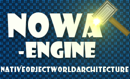
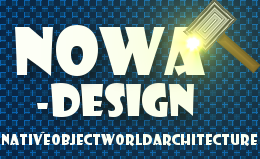
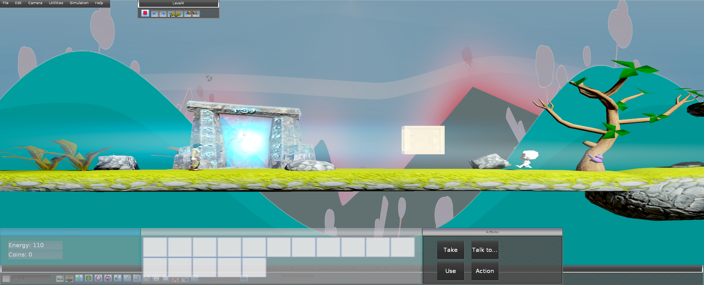

# NOWA-Engine



Games fascinated me even as a child. I was keen on understanding how a game does work behind the scenes. So I started to study media and computing to lay the foundations.

During my study, I started to develop an application in C++ to ease the creation of graphical simulations.
At that time I was inspired by Advanced Ogre Framework. Henceforward, all my projects where developed using the OgreBaseArchitecture, which is an DLL and can be linked to applications.
This had also the effect, that the OgreBaseArchitecture had been extended bit by bit. Now a few years have passed since 2010 and the engine is still growing. I re-branded the name to NOWA-Engine (NativeObjectWorldArchitecture-Engine).
NOWA is a word play for the same polish word, which means ‘new’. Put It in another words: from something old, something new emerges like a star that explodes in a nova creating something new.

The idea of the NOWA-Engine is to ease the development of games as far as possible, so the engine is as generic as possible.
Thus a lot of design patterns are used in the engine like Observer-, Eventing system with delegate functions, generic factory-, Composite-, State-, Strategy-, Singleton-, Null-Object-pattern, Curiously recurring template pattern etc.
The NOWA-Engine is intended for C++ developer and Designer with basic knowledge of the scripting language Lua.
The developer can concentrate on a higher level building a game without the need of taking care of lower level issues.
The NOWA-Engine became a hobby project and will be extended in future.

For more information see [http://www.lukas-kalinowski.com/Homepage/?page_id=1631](http://www.lukas-kalinowski.com/Homepage/?page_id=1631)

# NOWA-Design



The NOWA-Design editor uses the NOWA-Engine intensively. The editor can be used to create complex virtual environments. The speciality is its ability to test everything at runtime. The user may create a world add some GameObjects arm the GameObjects with some components to obtain some abilities like physics behaviors or particle effects, sounds etc. When the user presses the “Play” button. Everything will be rendered in realtime and the user may interact with the GameObjects. By pressing the “Stop” button everything will be placed in an “undo”-step to its stage before the simulation has happened. The biggest feature is that the LuaScriptComponent, that can be used for any game object, adding custom behavior at runtime, which is demonstrated in the video below “NOWA Design LuaScript AreaOfInterest”. The NOWA-Design editor has a lot of functionalities. Some will be listed below:

- Ogre-Next workspace management to create and change workspaces for “Physically Based Shading” (PBS), skies and sky-reflections at realtime
- Full integrated undo/redo functionality
- Camera position/orientation undo/redo functionality
- GameObject selection undo/redo functionality
- Gizmo in order to help transform GameObjects
- Several GameObject place modes like stacking and orientated stacking
- Creation of GameObject-groups and store them. So that complex scenarios can be created bit by bit
- Tons of components which can be added to GameObjects and activated
- Possibility to write own components with lua integration and plugin deployment
- Possiblity to create a C++ template project out of NOWA-Design for own game development
- Lua Api documentation within the editor
- Lua error feedback integrated in the editor
- Interface for Lua scripting and on the fly activation of the scripts
- Recast pathfinding integration
- Terra integration

# Demos
See: [http://www.lukas-kalinowski.com/Homepage/?page_id=1787](http://www.lukas-kalinowski.com/Homepage/?page_id=1787)



# How to get and build
- You need visual studio
- git clone origin git@github.com:Laxx18/NOWA-Engine.git
- On Windows open start menu and type: **Environment Variables**. Open the dialog.
- Click on the **Environment Variables** button.
- Create a new variable called **NOWA** and set the path to your cloned project directory.
- Navigate to the **NOWA_Engine** folder and open the **NOWA_Engine.sln** solution.
- Build all projects for release or debug mode in x64.
- If somehow a project does not build. Build it separately.
- Navigate further down to the **plugins** folder and open the **plugins.sln** solution.
- Build all projects for release or debug mode in x64.

# How to start
- Navigate to the bin\Release folder and open the **NOWA_Design.exe**.
- The first time a graphics dialog does appear in which you can set some settings.
- For best NOWA-Design work, set **Full Screen** to **No**.
- If you want to change some settings in future. Just delete the **ogre.cfg** file.
- Click on **File**->**Open**->**Project1**->**Scene1.scene**
- This is just an small example scene.

# Setup NOWA-Lua Api and ide
- Each time you build the NOWA-Engine in the bin/Release folder a **NOWA_Api.lua** file is generated.
- This file can be used e.g. for **ZeroBrane Studio**, which is a lua ide. See [https://studio.zerobrane.com/](https://studio.zerobrane.com/)
- Install the studio.
- Navigate to **C:\Users\(yourUserName)\.zbstudio\user.lua**
- Set the following content
```
api = {'NOWA_Api'}
interpreter = "NOWA_Api"
autoanalyzer = true
acandtip.fillups = ".("
acandtip.ignorecase = true
acandtip.strategy = 1
outline.showcompact = false
outline.showflat = false
staticanalyzer.infervalue = true
staticanalyzer.luacheck = true
acandtip.nodynwords = false
acandtip.startat = 4
editor.tabwidth = 4
styles = loadfile('cfg/tomorrow.lua')('Tomorrow')
styles.indicator.fncall.fg = {240,0,0}
-- to change the type of the indicator used for function calls
styles.indicator.fncall.st = wxstc.wxSTC_INDIC_HIDDEN
```
- Paste the **NOWA_Api.lua** to the folder 'C:/Program Files (x86)/ZeroBraneStudio/api/lua/NOWA_Api.lua'. **Note:**: You may have different install location.

# Issues when starting the NOWA-Design
- If somehow the NOWA-Design does not start because some plugins are missing, just delete in the bin/Release or Debug folder the corresponding plugins in the **plugins.cfg** file.
- Alternatively you can just put a hash (#) for each to be deactivated plugin line.

# License
GPL v3
